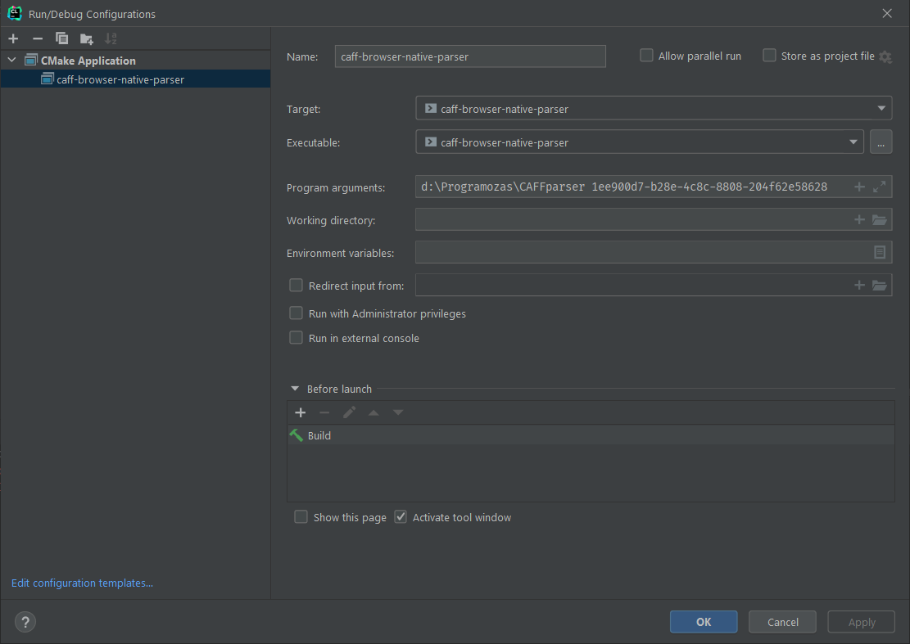

# Natív parser

## Felhasznált formátumok

- [CAFF formátum](docs/CAFF.txt)
  - tömörítés nélküli animációformátum
  - CIFF képek tárolására alkalmas
  - az animációhoz tartozó metaadatokat tárolja
- [CIFF formátum](docs/CIFF.txt)
  - tömörítés nélküli képformátum
  - pixel információkat tartalmaz
  - a képhez tartozó metaadatokat tárolja

## Futtatás

1. Repo klónozása.
2. `\CAFFparser\caff-browser-backend\src\main\resources\static` mappába `.caff` fájl helyezése. A program az ebben a mappában található képekből dolgozik. Az [images](/images) mappában található 3 db CAFF példa fájl, amivel tesztelhetjük a működést.
3. `\CAFFparser\caff-browser-native-parser` mappába az `output-json` és `output-images` kimeneti mappák létrehozása.
4. A repo elérési útvonalát és a fájlt nevét a `main` függvény `argv` listájából olvassa ki, emiatt erre szükség van a futtatási beállítások megadásánál.
   
5. A beparsolt CIFF fájlok az `output-images` mappába generálódnak `.ppm` formátumban.
6. A CAFF és CIFF fájlokhoz tartozó metaadatokból egy `.json` fájl kerül generálásra, amelyet az `output-json` mappában találunk.